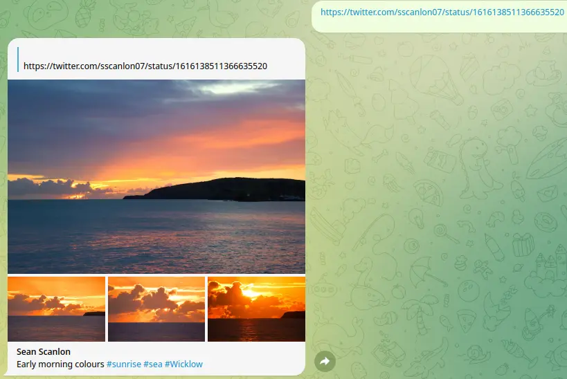
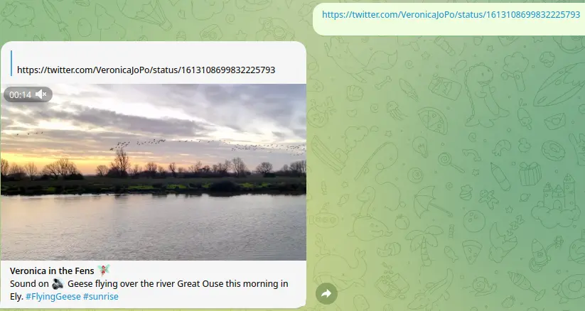
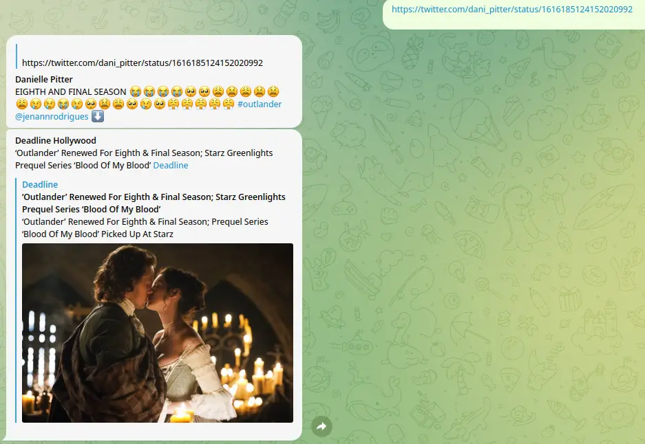
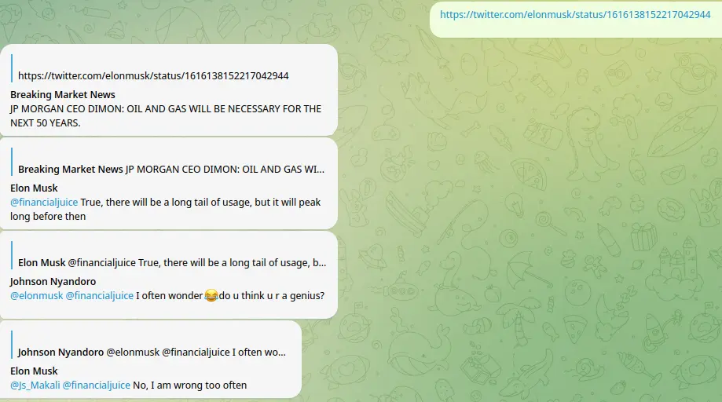

This bot can turn tweets into telegram messages, which is better than the default link preview.

# Features

You can send a link of tweet with multiple images:



Or with a video:



Or with a quoted tweet:


It can also can retrieve all tweets in a thread. Try to send a link of the LAST tweet of a thread:


# Deploy

## 1. Prerequisites
Install `python3` and dependencies in `requirements.txt`

## 2. Configure

### 2.1 Setting up config file
```
cp config-sample.toml config.toml
```
### 2.2 Fill in all the required varibles below:

- `api_id` and `api_hash`: set up in https://my.telegram.org/apps
- `bot_token`: get from https://t.me/BotFather
- `Bearer_Token`: refer to [this guide](https://developer.twitter.com/en/docs/authentication/oauth-2-0/application-only)

## 3. Run
```
python3 -m bot
```
